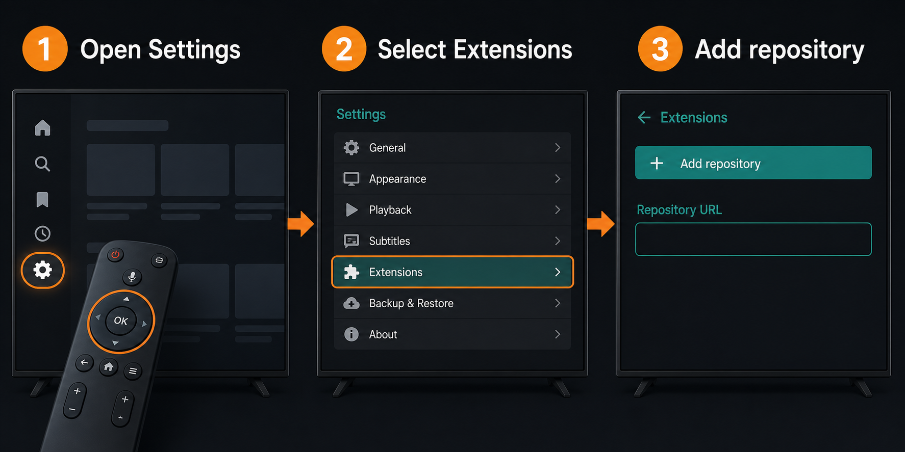
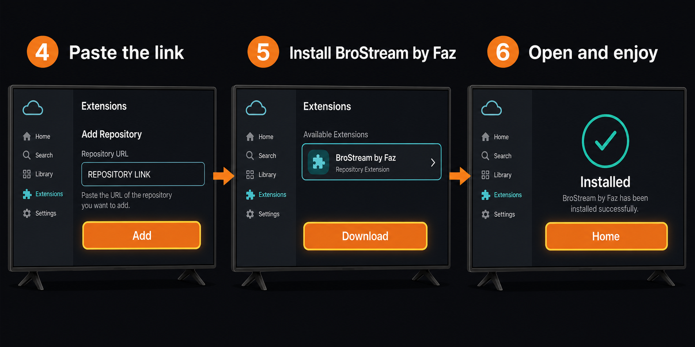

# BroStream by Faz

BroStream by Faz is an unofficial, adults-only CloudStream extension focused on gay-male content from multiple external sources.

> **Adults only (18+).** This project does not host videos. Availability depends on the external websites, your country, and your network. Only use it where doing so is lawful. The pictures below are illustrations; the wording on your CloudStream screen may be slightly different.

## The link you need

Copy this complete repository link:

```text
https://raw.githubusercontent.com/efczpaclasses-boop/brostream-by-faz/builds/repo.json
```

Do not remove any letters, slashes, or dots from the link.

## Install BroStream by Faz

1. Open **CloudStream** on your phone, tablet, Android TV, or Chromecast.

2. Open **Settings**. On a television, move to the gear-shaped icon and press the middle **OK** button on your remote.

3. Select **Extensions**.

4. Select **Add repository**. If you see a **+** button instead, select that button.



5. If CloudStream asks for a repository name, enter:

   ```text
   BroStream by Faz
   ```

6. Select the box marked **Repository URL** or **Repository link**.

7. Paste this complete link into that box:

   ```text
   https://raw.githubusercontent.com/efczpaclasses-boop/brostream-by-faz/builds/repo.json
   ```

8. Select **Add repository**, **Add**, or **Save**. You should now see **BroStream by Faz** in the repository list.

9. Open the **BroStream by Faz** repository.

10. Select the **BroStream by Faz** extension.

11. Select **Download** or **Install**.

12. If Android asks whether you want to install it, select **Install** again.



13. Return to the CloudStream home screen.

14. Open the provider selector at the top of the screen.

15. Select **BroStream by Faz**. The extension is now ready.

## If it does not appear

1. Open **Settings → Extensions → Repositories**.

2. Confirm that **BroStream by Faz** appears in the list.

3. Open it and check that the extension says **Installed**.

4. Restart CloudStream completely.

5. Check the repository link carefully if it still does not appear. It must end with `/builds/repo.json`.

## Updates

CloudStream checks the repository for newer versions. When an update appears, open **Settings → Extensions → Updates** and install it. Automatic update behaviour depends on your CloudStream version and settings.

## Privacy and safety

- This extension does not require an account.
- It connects directly to the listed external websites when you browse or play something.
- Do not use it to bypass logins, subscriptions, paywalls, regional controls, or other access restrictions.
- Report broken categories or playback through this repository's **Issues** tab without posting personal information.

## For developers

Build locally with:

```bash
./gradlew BroStreamByFaz:make makePluginsJson
```

The GitHub build workflow publishes the extension catalogue to the `builds` branch. The scheduled health check tests the four catalogue sources every six hours and reports a failed run when a source no longer matches the expected page structure.
